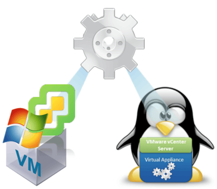

# #migrate2vcsa Resources

A collection of useful links and resources related to the Windows vCenter Server to vCenter Server Appiance (VCSA) Migration.

# #migrate2vcsa URL Shortners
* [http://vmwa.re/migrate2vcsa - Release Notes](http://vmwa.re/migrate2vcsa)
* [http://vmwa.re/migrate2vcsadoc - Docs](http://vmwa.re/migrate2vcsadoc)
* [http://vmwa.re/migrate2vcsafaq - FAQ KB](http://vmwa.re/migrate2vcsafaq)
* [http://vmwa.re/migrate2vcsademo - Video Demo](http://vmwa.re/migrate2vcsademo)
* [http://vmwa.re/migrate2vcsalinks - This page](http://vmwa.re/migrate2vcsalinks)
* [http://vmwa.re/migrate2vcsastories - vCommunity Stories w/the VCSA Migration](http://vmwa.re/migrate2vcsastories)

# Release
 * [vSphere 6.0 Update 2m Release Notes](http://pubs.vmware.com/Release_Notes/en/vsphere/60/vsphere-vcenter-server-60u2m-release-notes.html)
 * [vSphere 6.0 Update 2m Download](https://my.vmware.com/web/vmware/details?downloadGroup=VC60U2M&productId=491&rPId=12376)
 * [vSphere 6.0 Update 2m Migration User Guide](http://pubs.vmware.com/vsphere-60/index.jsp#com.vmware.vsphere.migration.doc/GUID-2DC0A6B8-FBFD-49A0-BA5B-2783B8A47817.html)

# Blogs
 * [vCenter Server Appliance (VCSA) Migration Tool officially GAs w/vSphere 6.0 Update 2m](http://www.virtuallyghetto.com/2016/09/vcenter-server-appliance-vcsa-migration-tool-officially-gas-wvsphere-6-0-update-2m.html)
 * [vCenter Server Migration Tool: vSphere 6.0 Update 2m](https://blogs.vmware.com/vsphere/2016/09/vcenter-server-migration-tool-vsphere-6-0-update-2m.html)
 * [vCenter Server 5.5 Windows to Appliance 6.0 Migration](https://haveyoutriedreinstalling.com/2016/09/15/vcenter-server-5-5-windows-to-appliance-6-0-migration/)
 * [How to tell if your vCenter Server Appliance (VCSA) was migrated from a Windows vCenter Server?](http://www.virtuallyghetto.com/2016/09/how-to-tell-if-your-vcenter-server-appliance-vcsa-was-migrated-from-a-windows-vcenter-server.html)
 * [How to check the size of your Config + Stats, Events, Alarms & Tasks (SEAT) data in the VCDB?](http://www.virtuallyghetto.com/2016/09/how-to-check-the-size-of-your-config-stats-events-alarms-tasks-seat-data-in-the-vcdb.html)
 * [Preparing for a vCenter Server Migration using the vSphere 6.0 Update 2m Migration Tool – Part 1](https://blogs.vmware.com/vsphere/2016/09/preparing-for-a-vcenter-server-migration-using-the-vsphere-6-0-update-2m-migration-tool-part-1.html)
 * [Preparing for a vCenter Server Migration using the vSphere 6.0 Update 2m Migration Tool – Part 2](https://blogs.vmware.com/vsphere/2016/10/preparing-vcenter-server-migration-using-vsphere-6-0-update-2m-migration-tool-part-2.html)
 * [Preparing for a vCenter Server Migration using the vSphere 6.0 Update 2m Migration Tool – Part 3] (https://blogs.vmware.com/vsphere/2016/10/preparing-vcenter-server-migration-using-vsphere-6-0-update-2m-migration-tool-part-3.html)

# Knowledge Base (KB) Articles / Documentation
 * [Migrating vCenter Server 5.5 to vCenter Server Appliance 6.0 Update 2m FAQ](http://vmwa.re/migrate2vcsafaq)
 * [Estimating vCenter Server 5.5 to vCenter Server Appliance 6.0 migration time](https://kb.vmware.com/kb/2146420)
 * [Active directory user permissions required for Windows vCenter to vCenter Server Appliance Migration](https://kb.vmware.com/kb/2146454)
 * [Moving Update Manager to a New Host Machine When Migrating vCenter Server to vCenter Server Appliance](http://pubs.vmware.com/vsphere-60/index.jsp?topic=%2Fcom.vmware.vsphere.migration.doc%2FGUID-B2642367-68BF-4EB8-81D4-F7791D501FD5.html)
 * [Rolling Back a Migration of vCenter Server 5.5 on Windows to vCenter Server Appliance 6.0 U2m or Later](https://kb.vmware.com/kb/2146453)

## Videos
 * [UI Demo - Migration of Windows vCenter Server 5.5 to vCenter Server Appliance 6.0 Update 2m](https://vimeo.com/177147961)
 * [CLI Demo - Migration of Windows Single Sign-On (SSO) 5.5 to External Platform Services Controller (PSC) 6.0 Update 2m](https://vimeo.com/178825553)
 * [CLI Demo - Migration of Windows vCenter Server 5.5 to vCenter Server Appliance (VCSA) 6.0 Update 2m]( https://vimeo.com/178825595)
 * [VMware vSphere 6.0 Update 2m (Migration)](https://youtu.be/bQv-mciwJ24)

## VMworld US 2016 Sessions
* [INF9044 - Journey to the vCenter Server Appliance: A Migration Story](http://vmware.mediasite.com/mediasite/Play/2576798222674c72bc998c5ceae32b771d?catalog=dbf1ec28-2557-4dd3-a381-e5fe4ceabc40)

* [INF8260 - Automated Deployment and Configuration of the vCenter Server Appliance](http://vmware.mediasite.com/mediasite/Play/414463c2038c4130855713b9c1a5b8ef1d?catalog=dbf1ec28-2557-4dd3-a381-e5fe4ceabc40)
